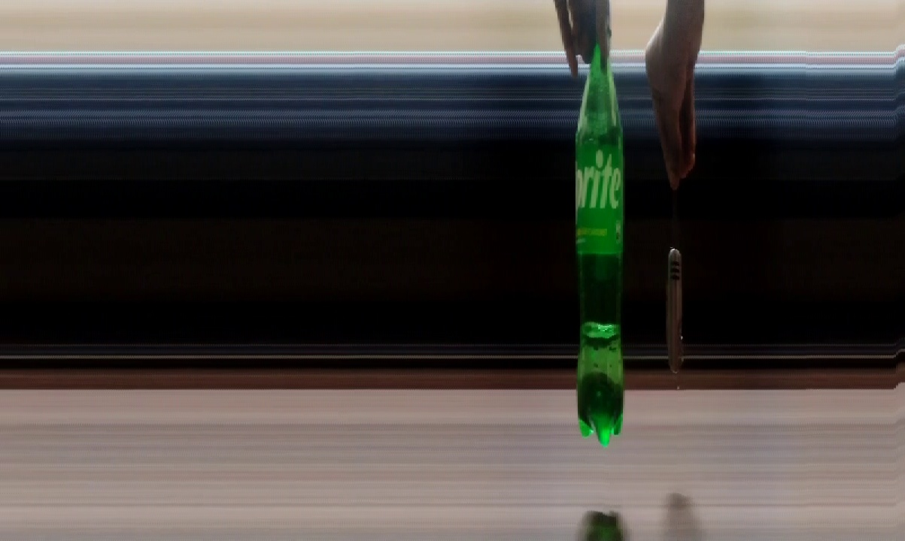

# FinishCam

A phone-based line-scan camera prototype for schools that cannot afford professional photo-finish equipment.

Built for a first-semester Design Thinking project.

---

## The Problem

Photo-finish cameras used at professional races are line-scan cameras. They use a single row of sensors that reads a thin vertical slice of a full frame at high speed, then stitches those lines side-by-side into one image. The horizontal axis (x-axis) of the output is **time**, and the vertical axis (y-axis) is **height at the finish line**.

These systems are expensive. They require dedicated hardware, a technician, and calibration. Schools, college tracks, and local race events cannot afford them.

## The Solution

FinishCam fakes a line-scan camera using only a smartphone and free software.

- **App (Expo / React Native)** — a camera app that records video with a green alignment line in the center of the screen. The user aims the line at the finish line and records the race.
- **Python script (OpenCV)** — extracts the center vertical column from every frame of the video and stitches them side-by-side into a photo-finish style image.

The result is not a photo of the scene. It is a time-space graph where horizontal position = time of crossing.

---

## How It Works

### The App

`src/app/index.tsx` uses `expo-camera` to display a fullscreen live camera preview with:

- A green vertical guide line down the center of the screen
- A record button (tap to start, tap to stop)
- A settings icon (currently a "Coming soon" modal)
- Portrait-locked orientation

When recording stops, the video is saved to the app's cache and offered to the user via the native Android/iOS share sheet (`expo-sharing`). The user can send it to Drive, email, WhatsApp, or save to files.

**Note:** The green line is a UI aiming guide only. It is intentionally **not** baked into the recorded video. If it were, the extracted center column would be solid green, ruining the output image. Any decorative line the user wants in the final image is added by the Python script after stitching.

### The Python Script

`python/linescan.py` takes a video file as input. For each frame:

1. Read the frame.
2. Extract a thin vertical slice (`SLICE_WIDTH` pixels wide) from the horizontal center of the frame.
3. Place that slice at the next horizontal position in an output canvas.
4. Repeat for every frame.
5. Save the resulting image.

Usage:

    python linescan.py <video_file>

Example:

    python linescan.py race_final.mp4

Output:

    race_final_linescan.jpg

The output image is `(num_frames × SLICE_WIDTH)` pixels wide and `frame_height` pixels tall.

---

## What the Output Looks Like

- **Static background** (track, grass, crowd) → smooth horizontal streaks, because the same pixels repeat across frames.
- **A runner crossing the line** → a smeared, forward-leaning figure. Their body intersects the center column over multiple frames; each frame captures a slightly different horizontal sliver of them.
- **A fast object** → wider, more stretched smear.
- **A slow object** → narrower, more solid column.
- **The finish line itself** → a perfectly vertical stripe, because it is static and always at the same position.

This is not a bug. It is exactly what a real photo finish looks like. The order of crossing is preserved: the object whose front-most pixel appears leftmost in the output crossed first.

---

## Test Results

The prototype was validated with controlled tests in an indoor setting, using a phone mounted on a stable surface and small objects passed perpendicular to the green guide line.

### Test 2 — Two objects, sequential crossing

A red bottle and a blue bottle were passed across the finish line one after the other, about 1.5 seconds apart.

**Input video:** `test_results/test2.mp4`

**Output:**

Both objects appear as distinct streaks at different horizontal positions in the output. Because horizontal position in the stitched image corresponds to time, the object that crossed first appears leftmost. This is the fundamental photo-finish property the prototype was built to demonstrate: **the order of crossing is preserved and visually unambiguous.**

### Observations

- **Static background → horizontal bands.** Confirms the stitching algorithm correctly aligns slices from a stationary camera.
- **Moving object → forward-leaning smear.** Matches the classic Olympic photo-finish distortion. This is expected and is a direct consequence of temporal sampling without a physical encoder.
- **Distinct horizontal positions → distinct timestamps.** The output is a genuine time-space diagram, not an artistic effect.

---

## Current Limitations

This is a **proof of concept**, not a finished product. The following limitations are known and accepted for this prototype:

### Capture

1. **Frame rate cap.** `expo-camera` records at the phone's default frame rate, typically 30fps. That gives us about 30 "line scans" per second, compared to 2,000–10,000 Hz on a real line-scan system. Good enough to prove the concept and better than the human eye, but not competition-legal.
2. **Resolution choice.** Recording is set to 480p to keep file sizes small. In broad daylight, this is plenty of resolution for a vertical slice. In poor lighting, the output may be noisy.
3. **No encoder.** A real line-scan camera is triggered by a physical encoder that measures object movement (e.g. "trigger one line every 1mm"). We have no encoder, so we sample in **time** (every 33ms) instead of **space**. This makes the output metrically inaccurate — you cannot measure a runner's actual body length from it. It **can** still definitively answer who crossed first and by roughly how many frames.
4. **Rolling shutter.** Phone sensors read pixels top-to-bottom, not all at once. Fast-moving objects appear to "lean forward" slightly. This matches the iconic Olympic photo-finish look and is left uncorrected.
5. **Phone must be stationary.** Any shake during recording creates a wobbly vertical stripe and a smeared output. A tripod or stable mount is required for good results.

### App

6. **No baked-in overlay in the recording.** The green guide line exists only in the live preview, not in the saved video. This is by design.
7. **Settings screen is a placeholder.** The gear icon opens a "Coming soon" modal. Resolution and FPS are hardcoded for the prototype.
8. **Portrait only.** Landscape mode with a horizontal slice is not supported yet.
9. **Cosmetic warning.** `CameraView` logs a warning that it does not officially support children (overlay elements). The overlays work fine but should eventually be moved to an absolute-positioned sibling view.

### Output

10. **No live processing.** The video must be transferred off the phone and processed on a laptop. Real-time on-device line-scan is a future goal.
11. **No auto-detection of the finish line.** The user must aim the green guide manually.

---

## Planned Improvements

The following are known directions for future work, in rough order of impact:

1. **Switch to `react-native-vision-camera`.** This unlocks direct control over the camera format, allowing recordings at 60fps, 120fps, or higher depending on device hardware. Higher frame rate = more scans per second = finer time resolution = tighter finish-line disputes resolvable.
2. **Development build with custom native modules.** A dev build would allow:
   - Real-time frame access on device (no video file intermediary)
   - Baked-in overlays
   - Custom gallery folders (`expo-media-library` was removed because its latest version requires a native module not bundled with Expo Go)
   - Higher-fidelity video recording with configurable bitrate
3. **Real settings screen.** Let the user choose resolution, frame rate, and slice width before recording.
4. **Photo marker button.** A button that timestamps a moment during recording, which the Python script then extracts as a full-quality still.
5. **On-device stitching.** Port the Python algorithm to a native module or WASM so the output image is generated live, without the laptop step.
6. **Landscape mode.** Add a horizontal-slice mode for use with finish lines that are vertically oriented in the camera frame.
7. **Automatic finish-line detection.** Use edge detection or a trained model to lock the slice column onto a detected line rather than the hardcoded center.
8. **Tripod / mount accessory.** A 3D-printed phone mount with a bubble level, so field use does not depend on steady hands.
9. **Encoder input (theoretical).** For genuine spatial sampling, a Bluetooth encoder wheel could theoretically trigger captures. This is out of scope for a phone-only solution but worth noting as the "true" line-scan upgrade path.

---

## Project Structure

    finishcam-app/
    ├── src/app/index.tsx          # Camera app (main screen)
    ├── src/app/_layout.tsx        # Navigation wrapper
    ├── python/linescan.py         # Line-scan stitching script
    ├── test_results/              # Input videos and output images for tests
    ├── app.json                   # Expo config (orientation, permissions)
    └── README.md

---

## Setup

### App (Laptop)

    npx expo install expo-camera expo-sharing
    npx expo start

### Camera (Phone)

1. Scan the QR code with **Expo Go** (Android) or the default camera app (iOS).
2. Record the Race
3. Use the Share option and share the video to the laptop

### Script (Laptop)

    pip install opencv-python
    python python/linescan.py <video_file>
